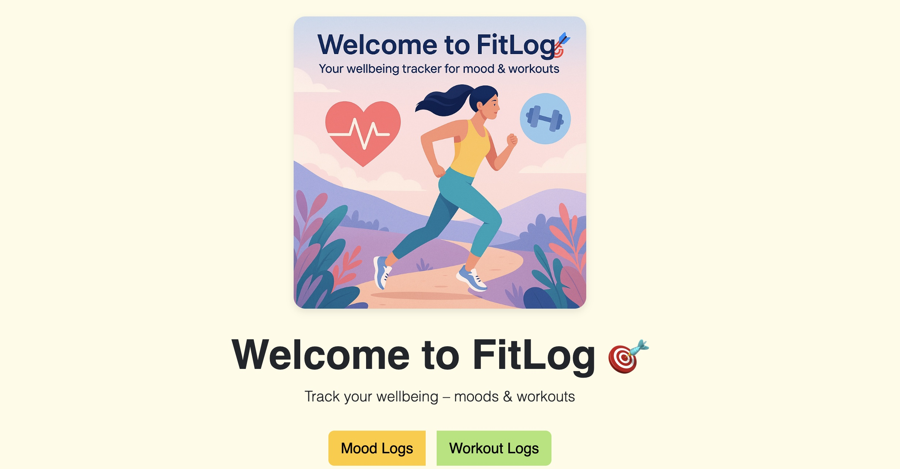
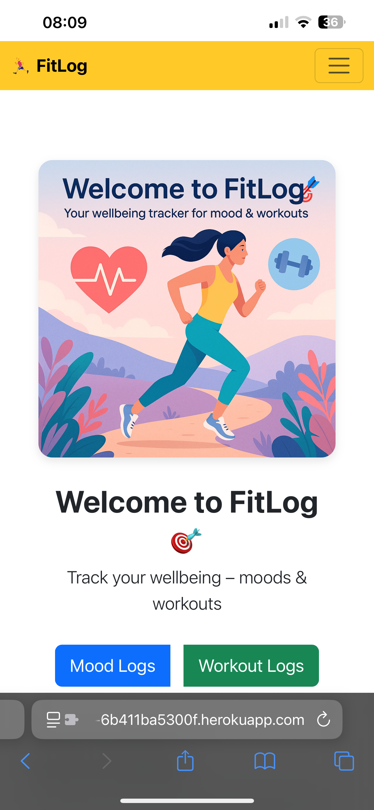
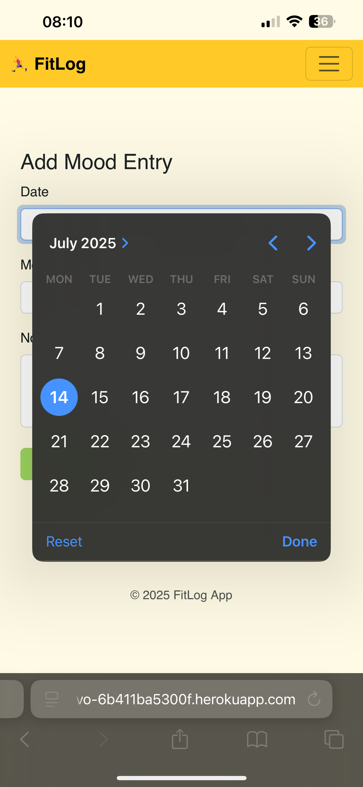

<!-- Main screenshot - larger display -->

<h3>🏁 Welcome Screen</h3>

FitLog is a wellbeing tracking app designed to help users log their moods and workouts to support physical and emotional health.
👉 Live App

⸻

📱 Mobile Experience

FitLog is fully responsive and adapts seamlessly to mobile and tablet devices. Navigation collapses into a hamburger menu for smaller screens, and all features remain accessible and intuitive.

🔄 Navigating on Mobile
	•	Tap the ☰ icon (top-right) to open the menu.
	•	Select Add Workout or Add Mood to log entries.
	•	Tap the FitLog logo 🏃‍♂️ (top-left) anytime to return to the homepage.

📸 Mobile Screenshots

⸻

📑 Table of Contents
	•	🧠 User Experience Design
	•	🎯 Strategy Plane
	•	🗂️ Agile Planning
	•	🧩 Epics
	•	👤 User Stories
	•	🧭 Using the App
	•	📌 Scope Plane
	•	🏗 Structure Plane
	•	🔧 Features
	•	🧪 Features Left to Implement
	•	📐 Skeleton Plane
	•	📲 Wireframes
	•	🎨 Surface Plane
	•	🖼 Design
	•	🌈 Colour Scheme
	•	🔤 Typography
	•	🖌 Imagery
	•	🛠 Technologies
	•	✅ Testing
	•	👀 Manual Testing
	•	🧾 Test Cases
	•	📊 Lighthouse Audit
	•	🚀 Deployment
	•	🔁 Version Control
	•	🌐 Heroku Deployment
	•	💻 Run Locally
	•	🍴 Fork Project
	•	💬 Credits

⸻

🧠 User Experience Design

🎯 Strategy Plane

The goal of FitLog is to provide users with a simple and intuitive tool to track their wellbeing through mood logging and workout tracking.
The platform promotes self-awareness and long-term health improvements through consistency and simplicity.

🗂️ Agile Planning

The project was managed using Agile methodology and divided into sprints. GitHub Projects board was used to track epics, tasks, and user stories.

🧩 Epics
	1.	Base Project Setup
	2.	Authentication System
	3.	Mood Logging Module
	4.	Workout Logging Module
	5.	UI and Navigation
	6.	Deployment Configuration
	7.	Documentation and README

👤 User Stories
	•	As a user, I want to register and log in so I can track my progress.
	•	As a user, I want to add/edit/delete moods.
	•	As a user, I want to track workouts with date, activity, and notes.
	•	As a user, I want a simple and responsive interface on any device.
	•	As a user, I want to securely log out of my session.

⸻

🧭 Using the App

🏠 Homepage

After login, the user sees a welcoming homepage with light design and navigation at the top.

🔐 Authentication
	•	Register, log in and log out via secure forms.
	•	CSRF protection enabled.

💪 Workout Logging
	•	Add/edit/delete workouts with date, type, duration, and optional notes.

😊 Mood Logging
	•	Add/edit/delete moods with 1–5 level scale and optional notes.

🧭 Navigation
	•	Navbar adapts to user state.
	•	Facebook/Instagram icons in the header and footer link externally.

⸻

📌 Scope Plane

MVP Features
	•	Responsive layout
	•	Authentication system
	•	Mood + Workout CRUD operations
	•	Navigation bar

⸻

🏗 Structure Plane

🔧 Features
	•	Mood & Workout logs
	•	Form validation
	•	Authentication + Logout redirect
	•	User-specific querysets

🧪 Features Left to Implement
	•	Mood trend graphs 📈
	•	Profile with stats 🧍
	•	Reminders or motivational quotes 🧘‍♂️

⸻

📐 Skeleton Plane

📲 Wireframes

Basic wireframes were planned with mobile-first layout:
	•	Homepage
	•	Mood & Workout pages
	•	Authentication screens

⸻

🎨 Surface Plane

🖼 Design

Bright, uplifting layout with minimal distractions.

🌈 Colour Scheme
	•	#fffbe6 background
	•	#fff3cd hero sections
	•	Bootstrap defaults

🔤 Typography

Segoe UI and fallback sans-serif

🖌 Imagery
	•	Custom AI illustration
	•	FontAwesome icons
	•	Favicon via Canva

⸻

🛠 Technologies
	•	Frontend: HTML5, CSS3, Bootstrap
	•	Backend: Python, Django
	•	DB: SQLite (dev) / PostgreSQL (prod)
	•	Deployment: Heroku
	•	Versioning: Git & GitHub
	•	Other: dotenv, dj-database-url, widget-tweaks

⸻

✅ Testing

👀 Manual Testing

Performed across:
	•	Chrome
	•	Firefox
	•	Safari (iOS + Mac)

🧾 Test Cases

Feature	Expected	Result
Register	Redirects to home	✅
Login	Home visible	✅
Add Mood	Entry added	✅
Edit Mood	Entry updated	✅
Delete Mood	Entry removed	✅
Add Workout	Added and displayed	✅
Logout	Session ended	✅

📊 Lighthouse Audit
	•	Performance ✅
	•	Accessibility ⚠️ (button contrast suggestions)
	•	Best Practices ✅
	•	SEO ⚠️ meta description planned

⸻

🚀 Deployment

🔁 Version Control

git add .
git commit -m "Meaningful message"
git push origin main

🌐 Heroku Deployment
	•	Heroku app with PostgreSQL addon
	•	Config vars for SECRET_KEY, DEBUG etc
	•	Static files via WhiteNoise
	•	Deployed from GitHub

💻 Run Locally

git clone https://github.com/your-username/fitlog.git
cd fitlog
pip install -r requirements.txt
python manage.py migrate
python manage.py runserver

🍴 Fork Project

Click Fork in top-right corner of the repository.

⸻

💬 Credits
	•	Code Institute Mentorship
	•	“Sizzle & Steak” structure reference
	•	Icons by Font Awesome
	•	Hero/Favicon by Canva
	•	Compression via TinyPNG
	•	Code validation with W3 Validator

Special thanks to Alex (OpenAI GPT) for technical support and code validation assistance.

⸻

🔗 Live Project: https://fitlog-app-ivo-6b411ba5300f.herokuapp.com/
